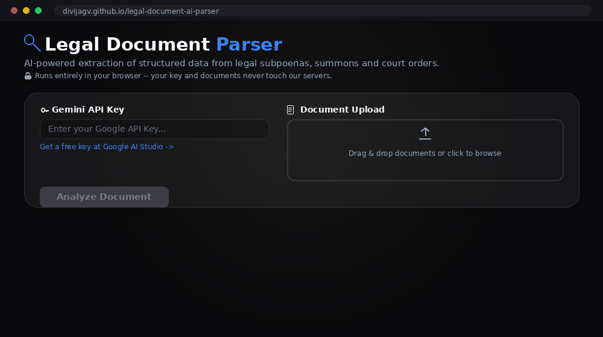

# Legal Document AI Parser

An AI-powered document intelligence tool for extracting structured data from unstructured legal documents — subpoenas, summons, court orders, and similar records requests.

Drop in a document and get back a structured record: who it's addressed to, what's being requested, the case number, key dates, the requesting party, and a confidence score flagging anything that needs a human to double-check.



## How it's built

This repo contains two independent ways to run the extraction. **The static web app is the primary, public-facing product.** The Flask backend is a secondary option for anyone who wants a hosted version with a shared server-side API key.

1. **Web app** (`index.html` / `app.js` / `style.css`, at the repo root) — a static site with no server. It calls the Gemini API directly from your browser using a key you provide. This is what's deployed via GitHub Pages (see `.github/workflows/deploy.yml`), and what most users should use.
2. **Flask backend** (`app.py` / `templates/` / `static/` / `legal_parser_agent/`) — a Python server built on [Google's Agent Development Kit](https://google.github.io/adk-docs/), deployable to Render (see `Procfile` / `requirements.txt`). Useful if you want to host a version that doesn't require visitors to bring their own API key, or want to run extraction from the command line via `main.py`.

Both use the same extraction schema and the `gemini-2.5-flash` model, but they're independent runtimes — the static site never talks to the Flask app.

## 🚀 Web App (primary)

No installation required. Open `index.html` in a browser, or visit the GitHub Pages deployment of this repo, then:

1. Paste in a Gemini API key — get a free one at [Google AI Studio](https://aistudio.google.com/apikey).
2. Drag in one or more subpoenas, summons, or court orders (PDF, PNG, JPG, or TXT — up to 20MB each).
3. Click **Analyze**. Each document gets its own row with a confidence tag; click a row to expand full detail, including masked sensitive fields (SSN, bank account) you can reveal on demand.
4. Export everything as JSON or CSV, or ask the built-in assistant follow-up questions about the results.

Your API key and documents are sent directly from your browser to Google's Generative Language API. Nothing passes through a server we control.

### Deploying it yourself

The included `.github/workflows/deploy.yml` publishes the repo root to GitHub Pages on every push to `master`. Enable Pages for this repo (Settings → Pages → source: `gh-pages` branch) and it's live at `https://<your-username>.github.io/legal-document-ai-parser/`.

## 🛠 Flask backend (optional, secondary)

Useful if you want to self-host a version with a server-side API key, or run extraction from the command line.

### Prerequisites

- Python 3.10+
- [uv](https://docs.astral.sh/uv/getting-started/installation/) (recommended) or pip
- A Gemini API key

### Local setup

```bash
git clone https://github.com/divijagv/legal-document-ai-parser.git
cd legal-document-ai-parser

uv venv
# macOS/Linux:
source .venv/bin/activate
# Windows PowerShell:
.venv\Scripts\Activate.ps1

uv sync
```

Set your API key, either as an environment variable or in `legal_parser_agent/.env` (already gitignored):

```bash
# macOS/Linux
export GOOGLE_API_KEY="your-actual-api-key"

# Windows PowerShell
$env:GOOGLE_API_KEY = "your-actual-api-key"
```

Run the CLI directly against a file:

```bash
python main.py path/to/subpoena.pdf      # prints extracted JSON
```

Or run the Flask server and open `http://127.0.0.1:8080`:

```bash
python app.py
```

To test the agent in isolation instead (not the app's UI), use ADK's own dev console:

```bash
uv run adk web
```

This opens ADK's built-in playground on an agent-picker screen — it's for testing the agent, not the product experience.

### Deploying to Render

`Procfile` and `requirements.txt` are set up for a one-click Render web service: connect the repo, and Render will run `gunicorn app:app` using the dependencies in `requirements.txt`. Set `GOOGLE_API_KEY` as an environment variable in the Render dashboard if you want a shared server-side key instead of requiring visitors to bring their own.

## 🔒 Security & Privacy

- Neither the web app nor the Flask backend store your API key anywhere except your own browser's local storage, your own environment, or a `.env` file.
- The static web app never sends your key or documents to any server other than Google's.
- These documents often contain SSNs, bank account numbers, and dates of birth. The web app masks these fields in the UI by default (click "Show" to reveal). The Flask backend avoids logging full extraction output, including these fields, to the server console.
- Don't commit real API keys to version control — `.env` and `.venv/` are already gitignored.

## 🧩 Features

- **AI-powered extraction** tuned for legal subpoenas and court orders, covering customer/addressee details, requestor information, case details, and key dates.
- **Multi-document support** — analyze several files in one batch; failures on one file don't block the others.
- **Confidence flagging** — each result is tagged `Verified` or `Needs Review` based on the model's own confidence score.
- **Masked sensitive fields** — SSNs and account numbers are hidden by default in the detail view.
- **Export** — download results as JSON or CSV, or copy to clipboard.
- **Document assistant** — ask follow-up questions about extracted results in a chat panel.

## 📁 Project structure

```
.
├── index.html                     # Web app markup (primary product)
├── app.js                         # Web app logic (calls Gemini directly from the browser)
├── style.css                      # Web app styling
├── .github/workflows/deploy.yml   # Publishes the web app to GitHub Pages
│
├── app.py                         # Flask entry point (secondary/optional)
├── main.py                        # CLI entry point for the local backend
├── templates/index.html           # Flask template
├── static/style.css               # Flask static styling
├── legal_parser_agent/
│   ├── agent.py                     # ADK agent + extraction/validation logic
│   └── .env                         # Local-only API key (gitignored)
├── Procfile                       # Render/Heroku process definition
├── requirements.txt               # pip dependencies for the Flask backend
└── pyproject.toml                 # Python dependencies for uv / the CLI
```

## Disclaimer

This tool assists with document review; it does not provide legal advice, and extracted data should be verified by a qualified person before being relied on, especially anything flagged `Needs Review`.
